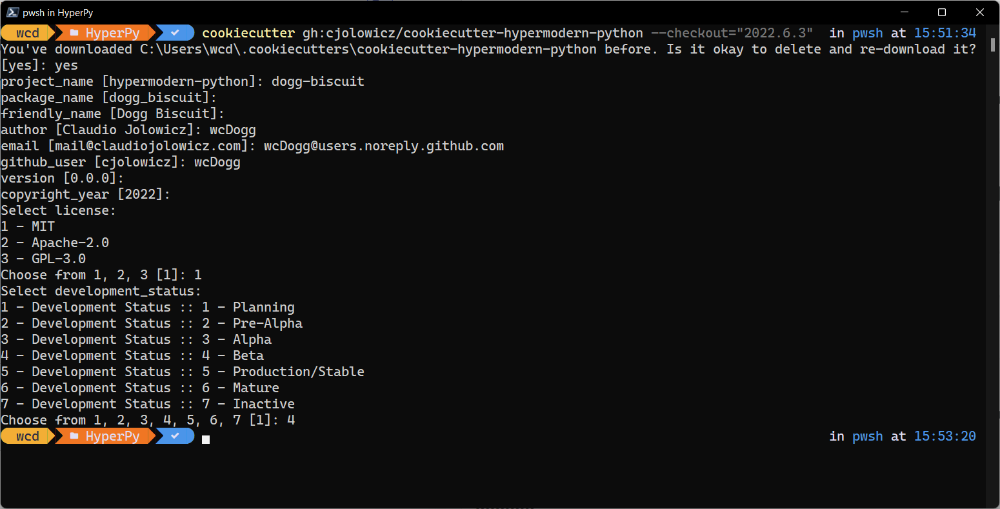

# Generate a Cookiecutter Project

This topic covers how to generate a Cookiecutter project and initialize its Git repository. Before completing these steps, see [External Services](../environment/external-services.md).

## Project Names

Before generating a project, go here and review the variables you'll be prompted for: [project variables](https://cookiecutter-hypermodern-python.readthedocs.io/en/latest/guide.html#project-creation).

Notice Cookiecutter uses hyphens for project-names and underscores for package_names. Before creating a project, confirm the project-name you want to use isn't already taken on [PyPi](https://pypi.org/). I tried using `my-test` - doh!

## Generate the Project

Cookiecutter projects are generated from a template. Go here and note the latest release version number: [cookiecutter-hypermodern-python/releases](https://github.com/cjolowicz/cookiecutter-hypermodern-python/releases).

Each project is a directory / repository. In PowerShell, `cd` to the location where you want the project directory generated. Using the current version number, run:

```powershell
cookiecutter gh:cjolowicz/cookiecutter-hypermodern-python --checkout="2022.6.3"
```



## Initialize Git

**IMPORTANT:** Only initialize Git - don't push the project to GitHub yet.

```powershell
cd dogg-biscuit
git init -b main
git add . && git commit -m "Initial commit"
```

## Edit **main**

While Dogg Biscuit is about learning Cookiecutter using the default project, I did edit `__main__.py`:

- Edit the `main()` doc string - say something descriptive.
- Add a `print('Hello, World!)` statement to `main()`.

```powershell
git add . && git commit -m "Added doc string + print statement"
```

## Edit pyproject.toml

As of the 2022.6.3 Cookiecutter template, flake8 5.0.0 introduces a breaking change. I know Dependabot catches this, but I'm not sure if Poetry does, so I've edited `pyproject.toml` to `flake8 = "==4.0.1"`.

```powershell
git add . && git commit -m "Locked flake8 to 4.0.1"
```
