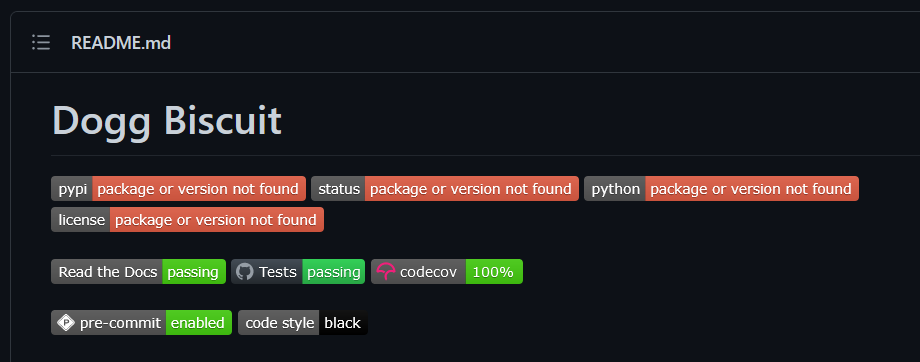

# Run Tests

## Reference

Run all tests or a single test:

```powershell
nox
nox -s pre-commit
nox -s mypy
nox -s tests
nox -s coverage
nox -s docs
nox -s safety
nox -s typeguard
nox -s xdoctest
```

You'll find you need to run certain tests multiple times. Speed things up by reusing the virtual env:

```powershell
nox -rs pre-commit-3.10
nox -rs mypy-3.10
nox -rs tests-3.10
nox -rs =coverage-3.10
nox -rs docs-3.10
nox -rs safety-3.10
nox -rs typeguard-3.10
nox -rs xdoctest-3.10
```

If you run into problems, use `trace`:

```powershell
nox --session=tests -- -m trace --trace
```

## Python Versions

Nox runs tests against multiple versions of Python. I use [pyenv-win](../environment/install-python.md) to manage multiple versions. Before running Nox, run the command below to make the needed versions available in the current directory. This must be done once per Poetry session.

```powershell
pyenv local 3.7.9 3.8.10 3.9.13 3.10.6
```

## Set pre-commit Hook

Run the `pre-commit` session with `install` one time to set GitHub hooks. This must be done once per project.

```powershell
nox -s pre-commit -- install
```

## Run a Single Test

Before running all tests, run just pre-commit to see how things are working:

```powershell
nox -s pre-commit
```

## Git Commit

**IMPORTANT:** Each time you run Nox, black and other tools may modify files - this is clearly indicated in the console. Before testing again, you must commit the changes.

```powershell
git add .
git commit -m "Message"
git push # Check this is required? Seems wasteful.
```

## Run All Tests

Keep repeating this process until you've cleared the pre-commit test. Then run each test one-by-one. Once you're familiar with the tests and have the kinks worked out, you can switch to running all tests.

Once you've cleared all tests, push the commits to GitHub:

```powershell
git push
```

Have a look at the repository. At this point you should see all tests passing and the link to Read the Docs should work. Note it can take several minutes for the docs to generate.


